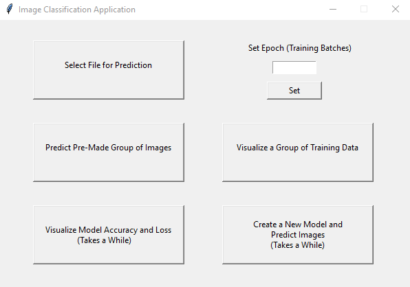
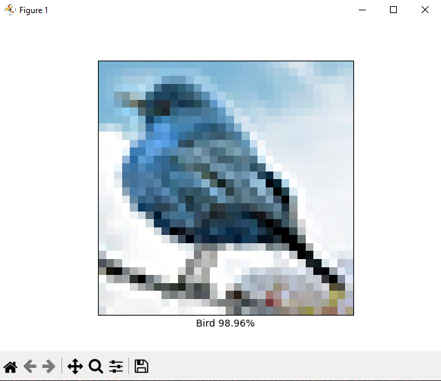
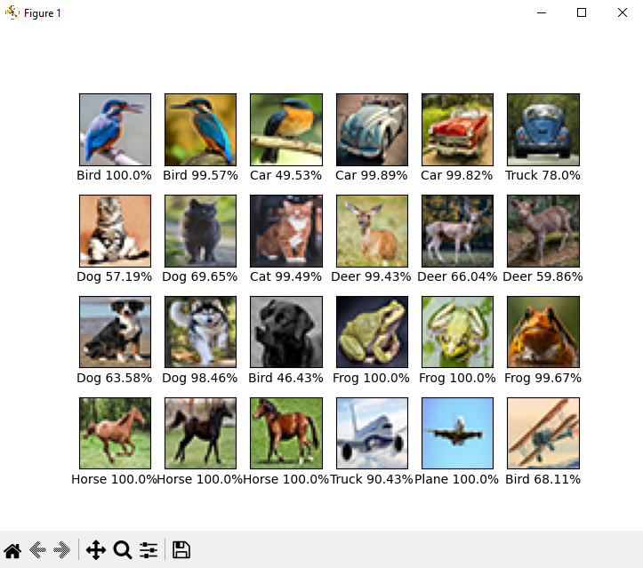

# Image Classification Application
 Image Classification Application that uses machine learning, made in python using tensorflow and keras, takes images and determines what type of image it is.
 
## Screenshots

**Main Menu**

**Single Prediction From File**

**Group Prediction**

## Tech Stack

**Client:** Python, Tensorflow, Keras
